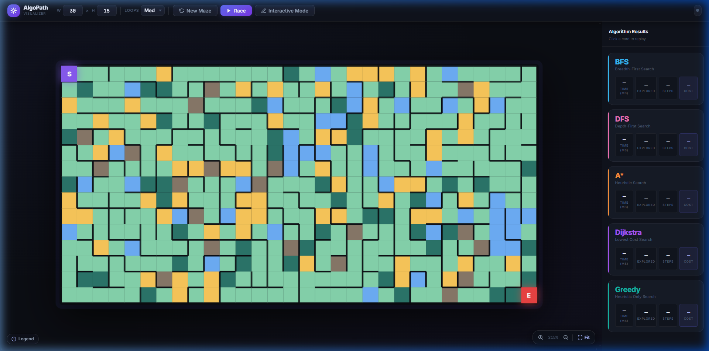
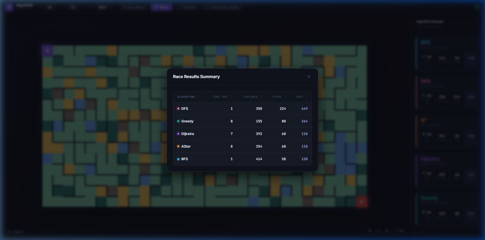
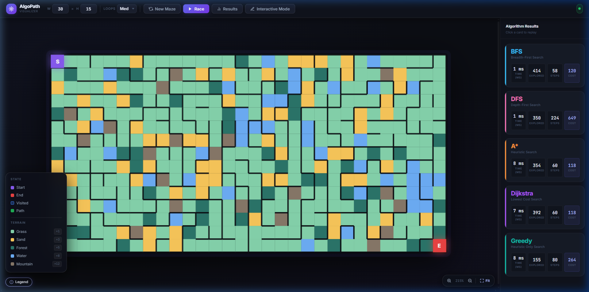
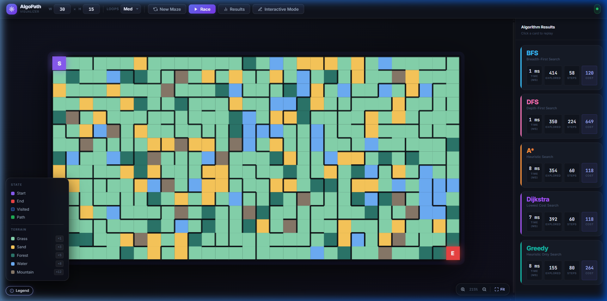
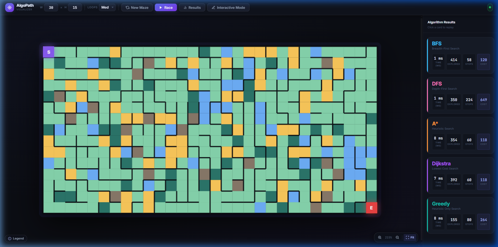
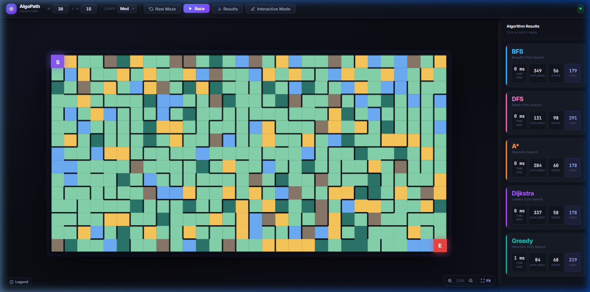

<div align="center">

# 🧭 AlgoPath Visualizer

### *Watch five pathfinding algorithms race through weighted terrain — simultaneously.*

<br/>

[](https://www.java.com/)
[](https://spring.io/projects/spring-boot)
[](https://developer.mozilla.org/en-US/docs/Web/JavaScript)
[](https://render.com/)
[](https://netlify.com/)

<br/>



<br/>

**[🚀 Live Demo](#getting-started) · [📸 Gallery](#-gallery) · [🏗 Architecture](#-architecture) · [⚙️ Running Locally](#-running-locally)**

</div>

---

## 📖 About The Project

**AlgoPath Visualizer** is a full-stack web application that brings algorithmic theory to life. It generates complex, weighted terrain mazes and then unleashes **five pathfinding algorithms simultaneously** — letting you watch, compare, and analyze how each one navigates the same problem.

The project goes well beyond a typical toy visualizer:

- 🔀 **Multithreaded backend** runs all algorithm simulations concurrently in Java threads
- 🌍 **Weighted terrain system** means algorithms must make real cost-vs-speed trade-offs  
- 🔁 **Complex maze generation** produces graphs with loops (cycles), not just trees  
- 📊 **Performance analytics** expose granular execution metrics: time, nodes explored, steps, path cost  
- 🖊️ **Interactive sandbox** lets you draw walls, move start/end points, and repaint terrain live  

It's built to demonstrate real computer science knowledge — from graph theory and heuristics to concurrent Java programming and modern frontend architecture.

---

## ✨ Feature Highlights

### ⚡ Algorithm Race Mode

Hit **Race** and all five algorithms launch simultaneously in parallel Java threads. Watch each algorithm's frontier expand in real-time across the shared grid canvas.



The **Race Results Summary** modal breaks down every metric by algorithm — sortable by column — so you can instantly compare their trade-offs.

---

### 🗺️ Weighted Terrain System

The grid isn't flat. Every cell has a **terrain type** that changes its traversal cost. Algorithms that account for weights (A\*, Dijkstra) will avoid expensive terrain to find cheaper routes, while unweighted algorithms (BFS, DFS) ignore costs entirely.



| Terrain | Color | Cost Multiplier |
|:--------|:-----:|:---------------:|
| 🌿 Grass | Green | ×1 |
| 🏜️ Sand | Yellow | ×3 |
| 🌲 Forest | Dark Green | ×5 |
| 💧 Water | Blue | ×8 |
| ⛰️ Mountain | Brown | ×12 |
| 🧱 Wall | Black | ∞ (impassable) |

The floating **Legend** (bottom-left) is always accessible without cluttering the main UI.

---

### 📊 Algorithm Results Sidebar

After each race, the right sidebar fills with live metric cards for all five algorithms. Each card shows:



- **Time (ms)** — wall-clock execution duration
- **Explored** — total nodes evaluated during traversal
- **Steps** — final path length in cells
- **Cost** — weighted sum of all terrain costs along the path

Click any card to **replay** that specific algorithm's animation on the grid.

---

### 🖊️ Interactive Sandbox Mode

Toggle **Interactive Mode** to enter an isolated editing environment where the grid becomes a canvas:

- **Left-click drag** → draw walls
- **Right-click drag** → erase cells  
- **Drag Start/End nodes** → reposition them anywhere
- **Terrain painting** → switch terrain types and paint directly

The mode toggle locks/unlocks UI controls to prevent accidental interference during editing.

---

### 🔁 Complex Maze Generation

Mazes aren't just perfect trees. A configurable **Loops** parameter injects extra connections into the generated graph, creating cycles and multiple valid paths — exactly the kind of complex graph structure that stress-tests real-world routing algorithms.


Configure **Width**, **Height**, and **Loop density** directly in the top navigation bar, then click **New Maze** to regenerate instantly.

---

### 🏁 No-Solution Detection

If the start and end nodes are isolated by walls or terrain, the system detects the mathematical impossibility and surfaces a clear **"No Solution Found"** notification rather than hanging or silently failing.

---

## 🏎️ Algorithms Implemented

| Algorithm | Strategy | Weighted? | Path Optimal? | Best For |
|:----------|:---------|:---------:|:-------------:|:---------|
| **A\* Search** | Heuristic (Manhattan distance) | ✅ | ✅ | Fastest optimal weighted search |
| **Dijkstra** | Lowest-cost-first | ✅ | ✅ | Exhaustive weighted correctness |
| **BFS** | Breadth-first, level-by-level | ❌ | ✅ (unweighted) | Shortest hop count |
| **DFS** | Depth-first, backtracking | ❌ | ❌ | Maze generation / stress test |
| **Greedy Best-First** | Heuristic only, no cost backtrack | ❌ | ❌ | Speed over correctness |

> **Key insight from the race results:** A\* and Dijkstra consistently find the lowest cost path (same cost number), but A\* explores significantly fewer nodes thanks to its Manhattan distance heuristic — demonstrating why heuristics matter in large graphs.

---

## 🏗 Architecture

The project decouples heavyweight algorithm computation from UI rendering via a clean client-server separation.

```
┌─────────────────────────────────┐     HTTP/REST      ┌──────────────────────────────────┐
│         FRONTEND                │ ◄─────────────────► │          BACKEND                  │
│  Vanilla HTML + CSS + JS        │                     │  Java 17 · Spring Boot 3.2.4      │
│  Netlify (Static Hosting)       │                     │  Render (Free Tier)               │
│                                 │                     │                                   │
│  • Grid canvas rendering        │     POST /maze      │  • Maze graph construction        │
│  • Animation frame scheduling   │     POST /solve     │  • Terrain generation             │
│  • Interactive drag events      │                     │  • Algorithm execution            │
│  • Results modal & cards        │  ◄── JSON frames ── │  • Multithreaded simulation       │
│  • Legend, zoom, fit-to-screen  │                     │  • Path serialization             │
└─────────────────────────────────┘                     └──────────────────────────────────┘
```

### Backend (`src/main/java/`)

| Component | Responsibility |
|:----------|:--------------|
| `MazeController` | REST endpoints for maze generation and solving |
| `MazeService` | Orchestrates parallel algorithm execution via thread pool |
| `Maze` | Graph model with loop injection and cycle creation |
| `Cell` | Node model: coordinates, terrain type, traversal cost |
| `TerrainGenerator` | Procedural terrain distribution across grid |
| `AStar / Dijkstra / BFS / DFS / Greedy` | Independent algorithm implementations |

### Frontend (`src/main/resources/static/`)

| Component | Responsibility |
|:----------|:--------------|
| `index.html` | SPA shell with semantic structure |
| `app.js` | Core grid rendering, animation loop, event wiring |
| `maze-api.js` | REST client, request/response lifecycle |
| `results.js` | Modal rendering, column sort, replay triggers |
| `index.css` | Full dark-theme design system, animations, legend |

---

## 📸 Gallery

<table>
  <tr>
    <td width="50%">
      <strong>Main Interface — Initial Load</strong><br/>
      
    </td>
    <td width="50%">
      <strong>Fresh Weighted Terrain Maze</strong><br/>
      
    </td>
  </tr>
  <tr>
    <td width="50%">
      <strong>Race Results Summary Modal</strong><br/>
      
    </td>
    <td width="50%">
      <strong>Terrain Legend + Algo Cards</strong><br/>
      
    </td>
  </tr>
  <tr>
    <td width="50%">
      <strong>Algorithm Metrics Sidebar</strong><br/>
      
    </td>
    <td width="50%">
      <strong>Full Dashboard View</strong><br/>
      
    </td>
  </tr>
  <tr>
    <td colspan="2">
      <strong>Final Race — All Paths Rendered Simultaneously</strong><br/>
      
    </td>
  </tr>
</table>

---

## 🚀 Running Locally

### Prerequisites

| Tool | Version |
|:-----|:--------|
| JDK  | 17 or higher |
| Maven | 3.6+ (or use included wrapper) |

### Steps

**1. Clone the repository**
```bash
git clone https://github.com/NiranjanSathishkumar/AlgoPath-Visualizer.git
cd AlgoPath-Visualizer
```

**2. Start the Spring Boot server**

*Linux / macOS:*
```bash
./mvnw spring-boot:run
```

*Windows:*
```powershell
.\mvnw.cmd spring-boot:run
```

**3. Open in your browser**
```
http://localhost:8080
```

The static frontend assets are served directly by Spring Web — no separate npm install or frontend build step required.

---

## ☁️ Deployment

The project uses a **100% free** cloud stack with zero ongoing cost:

| Layer | Platform | Notes |
|:------|:---------|:------|
| Backend API | [Render](https://render.com/) | Free tier · auto-deploy from GitHub |
| Frontend | [Netlify](https://netlify.com/) | Static hosting · CDN-served |
| Database | *(none needed)* | All state is in-memory per request |

> ⚠️ **Cold Start Warning:** Render's free tier spins down idle services. The first API request after inactivity may take **~30 seconds** while the server wakes up. Subsequent requests are instant.

The `render.yaml` and `netlify.toml` files in the repo root define the full deployment configuration including security headers and SPA routing rules.

---

## 🧠 Key Design Decisions

**Why vanilla JS on the frontend?**  
DOM manipulation at grid-cell granularity (thousands of cells per frame) benefits from fine-grained control without framework overhead. Vanilla JS gives full access to animation timing, event batching, and rendering pipelines.

**Why Spring Boot for a visualizer?**  
The backend isn't just serving static files — it performs real concurrent computation. Java's thread model, priority queues (for Dijkstra/A\*), and structured concurrency make it a natural fit for parallel algorithm simulation.

**Why separate frontend deployment from backend?**  
Decoupling lets the Netlify CDN serve the UI globally with zero latency while the compute-heavy Render backend only gets hit when a maze is generated or solved. This mirrors production microservice architecture.

---

<div align="center">

**Built to demonstrate full-stack engineering, algorithmic depth, and modern UI/UX design.**

*AlgoPath Visualizer — where computer science theory becomes interactive.*

</div>
