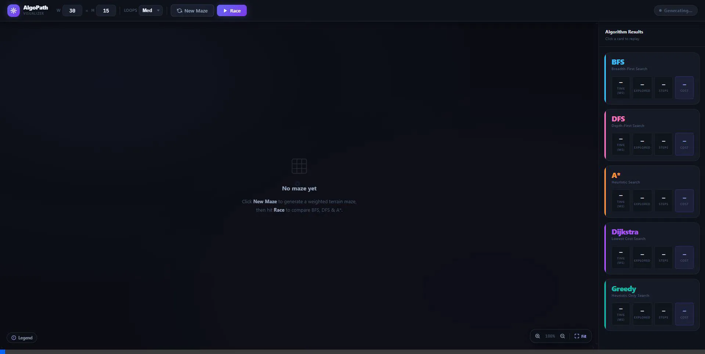
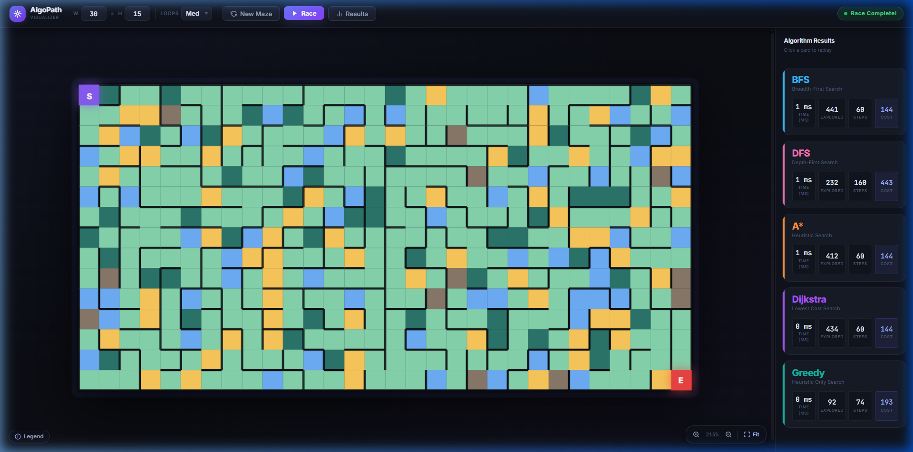
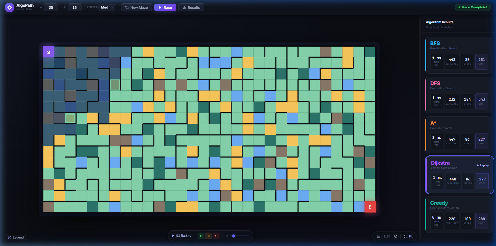
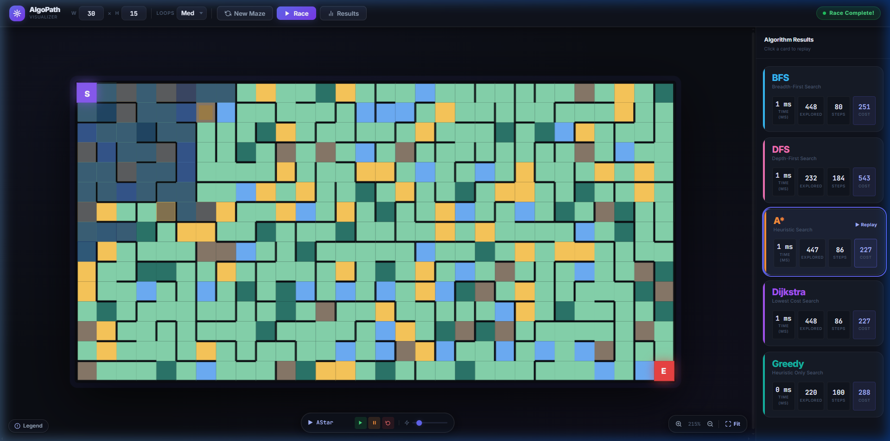
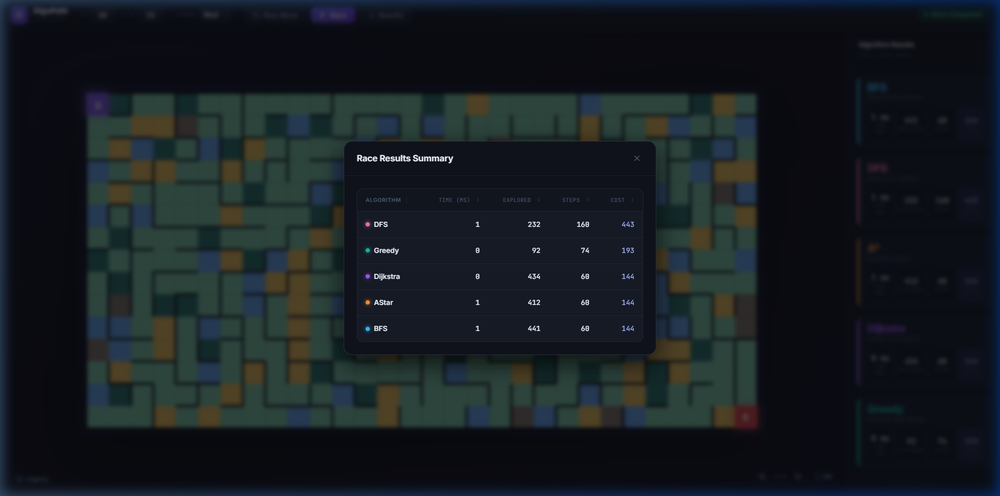

# AlgoPath Visualizer

**AlgoPath Visualizer** is a multithreaded web application designed to demonstrate and compare the performance of various pathfinding algorithms across randomly generated grids with weighted terrains. Using an intricate maze generation system and real-time frontend playback, it creates a visual "race" between algorithms to highlight their differences in operation and effectiveness.



---

## 🚀 Features

- **Interactive Maze Generation:** Generates customizable mazes with adjustable width, height, and path complexity (loop density).
- **Weighted Terrain System:** Features grid cells with distinct navigational costs:
  - 🟩 Grass (x1 multiplier)
  - 🟨 Sand (x3 multiplier)
  - 🌲 Forest (x5 multiplier)
  - 🌊 Water (x8 multiplier)
  - ⛰️ Mountain (x12 multiplier)
- **Competitive Algorithmic Racing:** Runs multiple pathfinding algorithms simultaneously on multi-threaded backend worker channels.
- **Visual Playback:** Offers an interactive interface to watch nodes be selectively explored (frontier highlights) progressing to the final calculated path overlay. 
- **Detailed Analytics Dashboard:** Analyzes race results quantitatively via an on-demand metrics dashboard plotting execution time, nodes explored, final steps taken, and optimal cumulative cost.

---

## 🧭 Implemented Algorithms

The application simultaneously executes and records the following pathfinders:

1. **Breadth-First Search (BFS):** Unweighted algorithm strictly attempting to find the path with the fewest number of steps from start to finish, ignoring terrain density differences entirely.
2. **Depth-First Search (DFS):** Diving aggressively deep into structural loops. Mostly sub-optimal output.
3. **A* Search Algorithm:** Calculates optimal heuristic estimates (combining path cost and distance). Consistently seeks and finds the lowest-cost path over the quickest node-distance.
4. **Dijkstra's Algorithm:** Mathematically traverses lowest-cost pathways rigorously. Ultimately finds the same optimal path as A* but tends to explore more total nodes globally to guarantee correctness.
5. **Greedy Best-First Search:** Driven solely by heuristic calculations (Manhattan distance to goal), blindly slicing down pathways ignoring cumulative terrain strain. Often incredibly fast to compute but frequently generates an expensive or non-optimal path.

---

## 📷 Screenshots

### 1. Main Application & Algorithm Progress
> Demonstrates the core UI where mazes are rendered dynamically with various terrains. Algorithm results are stacked allowing interactive playback controls via the timeline below the grid.



### 2. Algorithms in Action (Visual Replay)
> Pathfinding algorithms are vividly animated, highlighting their different topological approaches. For instance, Dijkstra systematically radiates out factoring in weighted path strain perfectly, while A* pushes more aggressively towards the target.

**Dijkstra's Algorithm (Lowest Cost Path):**


**A* Search (Heuristic Oriented):**


### 3. Performance Summary Results Modal
> Consolidates metrics for all competing algorithms in an ascending/descending sortable layout for rapid comparative analysis.



---

## 🛠️ Technology Stack

- **Backend:** Java 17, Spring Boot, Object-Oriented Multi-Threading.
- **Frontend:** Vanilla JavaScript (ES6+), HTML5, CSS3. (No external component libraries to ensure maximum DOM animation layout performance).
- **Build Tool:** Maven

---

## 💻 Getting Started (Local Development)

### Prerequisites
- JDK 17+
- Maven installed

### Running the Application

1. Open your terminal in the root directory.
2. Build and launch the Spring Boot server using Maven:
   ```bash
   mvn spring-boot:run
   ```
3. Open a modern web browser and navigate to:
   ```
   http://localhost:8080
   ```
4. Click **New Maze** to initialize a terrain landscape, then click **Race** to observe paths forming!
